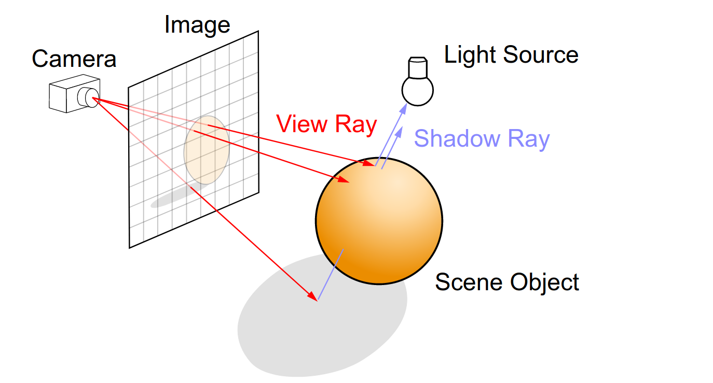
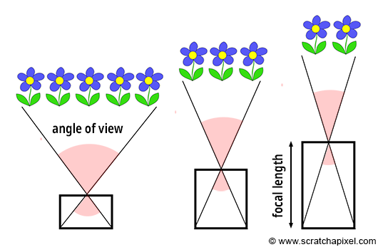
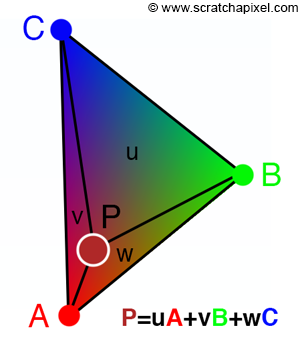

# Raytracer

В этой задаче вам предстоит написать игрушечный рейтрейсер, с помощью которого можно рендерить простейшие сцены ~и сделать нам аватарку на тг-канал~.

Для сдачи этого домашнего задания вы также должны сдать **3 вспомогательные задачи**:

* [raytracer-geom](../raytracer-geom)
* [raytracer-reader](../raytracer-reader)
* [raytracer-debug](../raytracer-debug)

При сдаче этой задачи вы можете не копировать код из вспомогательных задач, т.к. он будет доступен с помощью инклюдов как при локальной разработке, так и в тестирующей системе. Чтобы это работало используйте синтаксис `#include "header.h"`.

[Здесь](raytracer.h) вам необходимо реализовать функцию
```cpp
Image Render(const std::filesystem::path& path, const CameraOptions& camera_options, const RenderOptions& render_options);
```
* `path` - это путь до `.obj` файла сцены;
* [`camera_options`](options/camera_options.h) - характиристики камеры: габариты экрана и направление;
* [`render_options`](options/render_options.h) - характиристики трассировки: `depth` (глубина рекурсии) и `mode`;

В отличие от [raytracer-debug](../raytracer-debug), в этой задаче используется `mode = RenderMode::kFull`.

**Обратите внимание**, что помимо этого вы можете создавать произвольное число `.h` файлов в директории задачи. Все они будут учитываться при проверке решения на сервере.

### Базовый алгоритм
1. Ставим камеру и напротив неё экран.
2. Проводим луч из позиции камеры через каждый пиксель экрана.
3. Находим точку пересечение этого луча со сценой (ближайший объект).
4. Считаем освещённость в этой точке, записываем её как значение соответствующего пикселя.



#### Освещённость в точке
В нашей задаче будут только простейшие источники света. Нужно проитерироваться по всем и просуммировать вклад каждого в освещённость в точке. Если на пути к источнику света есть другой объект, то вклад этого источника не учитывается.

Для рассчёта освещённости будем пользоваться [моделью Фонга](https://en.wikipedia.org/wiki/Phong_reflection_model).
* Диффузия одного источника считается по формуле $`\mathrm{D_i = I * max(0, dot(v_l, n))}`$, где $`\mathrm{v_l}`$ - это направление от точки пересечения до источника, $`\mathrm{n}`$ - нормаль в точке пересечения, $`\mathrm{I}`$ - интенсивность источника.
* Бликовая составляющая одного источника считается по формуле $`\mathrm{S_i = I * max(0, dot(v_r, v_{lr}))^{Ns}}`$, где $`\mathrm{v_e}`$ - это проведённый луч, $`\mathrm{v_{lr}}`$ - отражённый луч от источника света в точке пересечения, $`\mathrm{I}`$ - интенсивность источника, $`\mathrm{Ns}`$ - характеристика материала.

Освещённость источниками света считается по формуле $`\mathrm{al_0 * (Kd \sum D_i + Ks \sum S_i) + Ka + Ke}`$.

##### Отражения
Пусть у нас есть функция, которая трассирует луч в заданном направлении и возвращает получившуюся освещённость. В случае отражающего материала $`\mathrm{(al_1 != 0)}`$ и находясь снаружи объекта, применим её рекурсивно к лучу, полученному в результате отражения исходного в точке. Освещённость, полученная рекурсивным вызовом и домноженная на отражающую способность материала $`\mathrm{(al_1)}`$, будет давать вклад в итоговую освещённость в точке. Глубина рекурсии ограничена настройкой [`depth`](options/render_options.h) рейтрейсера.

##### Преломления
Если материал прозрачный $`\mathrm{(al_2 != 0)}`$, то применим функцию трассировки к преломленному лучу. Обратите внимание, что `Ni` обращается, если луч находится внутри объекта. Для остальной среды коэффициент преломления равен `1`. Также **внутри** объекта прозрачность считаем равной `1` и не считаем отражённый луч. Снаружи объекта прозрачность считаем равной $`\mathrm{(al_2)}`$. Освещённость, полученная в результате рекурсивных вызовов и домноженная на прозрачность, будет давать вклад в итоговую освещённость в точке.

##### Итоговая формула
Итоговая освещённость считается по формуле $`\mathrm{al_0 * (Kd \sum D_i + Ks \sum S_i) + Ka + Ke + al_1 * I_{reflect} + al_2 * I_{refract}}`$, $`\mathrm{al_2 = 1}`$ внутри объекта.

#### Камера и экран
Для камеры задаются её положение `look_from` и то, куда она смотрит `look_to` (см. [`camera_options`](options/camera_options.h)). По умолчанию, камера расположена в начале координат и смотрит в направлении `-z`. Экран, на который смотрим мы, расположен на расстоянии `1` (это `focal length`), **всегда**. Ось `y` направлена вверх, `x` - вправо.



Так же для камеры задан `fov` (field of view) **по вертикали** и разрешение (`screen_width`, `screen_height`). `fov` по горизонтали подбирается таким образом, чтобы `width / height` экрана совпадало с `width / height` разрешения. Фиксированное `focal length`, означает, что разрешение экрана не задаёт, какую часть сцены мы увидим, а определяет размер пикселя в наших координатах. Пиксели квадратные. Лучи трассируются через центры пикселей.

Первым шагом нужно перевести пиксель на экране в пространство камеры, чтобы построить луч. Как это сделать, подробно написано [тут](https://www.scratchapixel.com/lessons/3d-basic-rendering/ray-tracing-generating-camera-rays/generating-camera-rays.html). Искомый луч имеет начало в точке, в которой расположена камера, и направлен в найденную точку в пространстве камеры (третья пространственная координата равна `-1`). Если бы камера находилась в начале координат, то можно было бы уже трассировать этот луч как есть. Однако камера может перемещаться, поэтому луч нужно уметь преобразовывать соответствующим образом. Это можно сделать с помощью матрицы `4x4` - `camera-to-world` и метода `look-at`. Подробности реализации можно найти [здесь](https://www.scratchapixel.com/lessons/mathematics-physics-for-computer-graphics/lookat-function/framing-lookat-function.html).

#### Возможные проблемы
* Не забывайте нормировать вектора, где это требуется. В частности **нормали**.
* Подумайте, какая из 2-ч нормалей к поверхности вам нужна.
* При рекурсивных вызовах для отражённых/преломленных лучей, происходит попадание в ту же точку. Отступите от поверхности в нужном направлении нормали на некоторый `kEps`.

#### Нормали
В `.obj` файле сцены для вершин треугольника могут быть явно заданы нормали, в таком случае нормаль к треугольнику в точке считается как проинтерполированное значение нормалей в вершинах с использованием [барицентрических координат](https://en.wikipedia.org/wiki/Barycentric_coordinate_system).



#### Постпроцессинг
Когда рендеринг завершен, и для каждой точки известна тройка $`\mathrm{v = (r, g, b)}`$, нужно произвести ряд действий.

##### Tone Mapping
Основная проблема состоит в том, что эти значения могут быть больше `1`, а чтобы сохранить изображение нужно иметь значения в диапазоне $`\mathrm{[0, 1]}`$.
Процедура приведения этих значений в диапазон $`\mathrm{[0, 1]}`$ обычно называется [tone mapping](https://en.wikipedia.org/wiki/Tone_mapping), и в нашем задании ее нужно сделать следующим образом:
1. Пусть наибольшее значение среди всех $`\mathrm{(r, g, b)}`$ по всем точкам изображения равно `C` (это скаляр, т.е. максимум берется и по самим тройкам).
2. Тогда вектор $`\mathrm{V_{in} = (r, g, b)}`$ нужно преобразовать в выходной $`\mathrm{V_{out}}`$ по правилу (все операции выполняются поэлементно)
```math
V_{out} = \dfrac{V_{in}\left(1 + \dfrac{V_{in}}{C^2}\right)}{1 + V_{in}}
```

##### Гамма коррекция
Теперь когда все значения лежат в диапазоне $`\mathrm{[0, 1]}`$ осталось сделать последний шаг. Все вычисления при рендеринге выполнялись в линейном RGB,
но при сохранении изображений линейный RGB практически никогда не используется, т.к. в этом случае нужно выделять больше 8 бит на канал (например
иметь значения в диапазоне $`\mathrm{[0, 2^{16}]}`$), чтобы изображение выглядело нормально. Пусть значение $`\mathrm{V_{out}}`$ получено с предыдущего шага.
Тогда в итоговое изображение нужно записать
```math
V_{gamma} = V_{out}^{\frac{1}{2.2}}
```

**Обратите внимание**, что класс [`Image`](../utils/image.h), через который происходит запись изображений, ожидает целочисленные rgb, т.е. полученное $`\mathrm{V_{gamma}}`$ нужно
домножить на `255` и привести в целые числа.

Подробнее можно прочитать на [вики](https://en.wikipedia.org/wiki/Gamma_correction), если интересно.


### Настройка окружения

На ubuntu установите следующие библиотеки:
```bash
sudo apt-get install libpng-dev
```

Для Mac:
```bash
brew install libpng
```

### Тесты

Каждый тест представляет из себя сравнение результата вашего рендера и авторского на одних и тех же входных данных. Обратите внимание, что в каждом тесте вы можете добавить в `CheckImage` дополнительный аргумент - путь до `.png` файла, куда будет
записан результат вашего рендера. Вы можете как угодно менять файл с тестами -
он не учитывается при тестировании вашего решения.

Вы также можете использовать фильтры, чтобы запустить только нужный вам тест. Например
```bash
./test_raytracer_asan "Box with spheres"
```

Ваше решение будет проверяться на двух типах сборки: `Asan` и `RelWithDebInfo`.
Причём некоторые тесты не будут запускаться в `Asan` сборке.

В силу структуры тестов у некоторых может возникнуть соблазн считать авторский ответ и выдать его как свой.
Авторы таких "решений" получат неуд. за весь курс.

### Бонус
У этой задачи есть **бонусная** подзадача:
* [ускорение рендеринга](../raytracer-b2)
