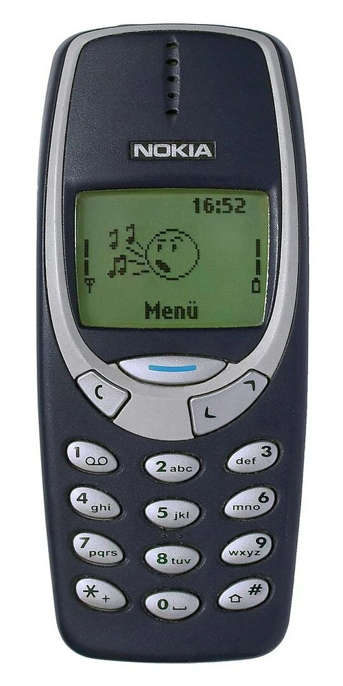

# SMS decoder

Давным-давно, когда на Земле никто ещё не слышал про Telegram и WhatsApp ~~и тем более про MAX~~ и все ходили с кнопочными телефонами, в роли мессенджера выступал [SMS](https://ru.wikipedia.org/wiki/SMS). В этом задании вам предоставляется некоторая история нажатий кнопок пользователем, который упорно пытается набрать sms на своём телефоне. От вас требуется расшифровать, что же такое напечатал пользователь.

Помимо прочих неурядиц, у пользователя отключена T9 и он вынужден честно перебирать символы, чтобы напечатать слово целиком. Например, для слова "who", ему требуется как минимум такая последовательность нажатий "944666".

## Входные данные

На входе строка, состоящая из символов `0-9`, `*`, `#`, `.`, каждый обозначает нажатие соответствующей кнопки.

## Правила восстановления сообщения

Язык итогового сообщения - латиница. Разрешены также цифры `[0-9]` и некоторые символы. Каждая цифра на клавиатуре соответствует набору последовательных букв и самой себе (**см. картинку**). Исключения:
* у `'1'` множество значений состоит только из `'1'`;
* у `'0'` множество значений `[' ', '0']` (`"0"` соответствует `' '` (пробел) и `"00"` соответствует `'0'`);
* у `'*'` множество значений `['.', ',', '?', '!']` (именно в таком количестве и порядке);
* `'#'` переводит следующий символ в верхний регистр (при чётном числе нажатий регистр не меняется: `"##2" -> "a"`);

Так как многократно нажимая одну кнопку, можно случайно пропустить нужный символ, множества значений зациклены. Например, для `'2': ['a', 'b', 'c', '2']` (цифра всегда идёт после других символов) верны соответствия: `"2" -> "a"`, `"22" -> "b"`, `"22222" -> "a"`.

Исключение: `"1" -> "1"`, `"11" -> "11"`, ... - то есть сколько раз нажали `'1'`, столько и напечатали.

В некоторых случаях при вводе слова нужно выдерживать паузу. Например, чтобы напечатать слово "Hello", пользователь вынужден между вводом первой и второй `'l'`. Такие паузы обозначены специальным символом `'.'`. Если в вводе встречается `'.'`, то это сигнал о том, что пользователь ввёл нужный ему символ и ищет следующий на клавиатуре телефона. Искать можно относительно долго, при этом последовательность `"2...."` переводится в просто `"a"`. 

